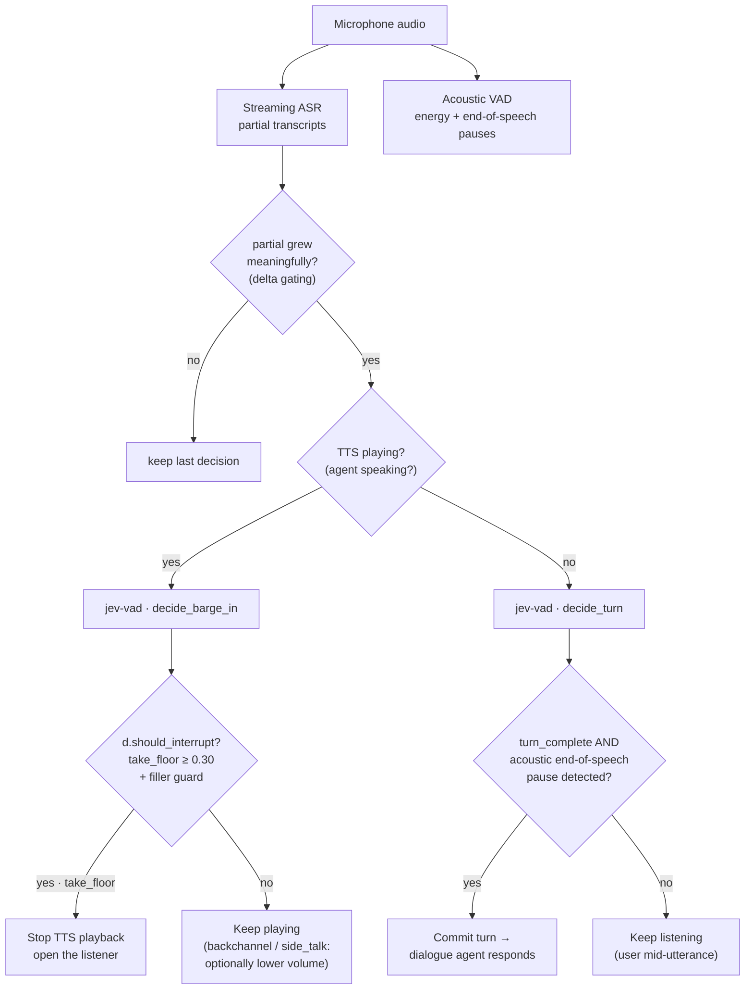

# jev-vad

**Semantic VAD for Spanish voice pipelines** — barge-in, backchannel
and turn-end detection over partial ASR transcripts, powered by the
[Laya](https://huggingface.co/convaiinnovations/laya) System-1 decision
model (int4-quantized ONNX, [mmBERT](https://huggingface.co/jhu-clsp/mmBERT-base)
multilingual encoder). CPU-only, no GPU required.

Instead of classifying audio energy, `jev-vad` asks the decision model
*questions about the transcript*: "is the user interrupting to correct
you, or just saying 'vale'?" and "is this utterance finished?". The
model artifact (~206 MB) is downloaded from the Hugging Face hub
automatically on first use.

## Install

```bash
pip install -e .            # this repo
# or, once published:
# pip install jev-vad
```

Requires Python ≥ 3.10. Runtime deps: `laya`, `onnxruntime`,
`huggingface-hub`, `truststore`.

## Quick start

```python
from jev_vad import TurnDetector

vad = TurnDetector()   # first call downloads ~206 MB, then cached

# Agent is speaking, user interjects — should TTS stop?
d = vad.decide_barge_in(
    "espera, que me he equivocado de fecha",
    agent_context="Su reserva está confirmada, referencia ABX123.",
)
print(d)                        # TurnDecision(take_floor 0.74, 350 ms)
print(d.should_interrupt)       # True  (tuned threshold + filler guard)

# Agent is silent — is the user done speaking?
d = vad.decide_turn("quiero reservar un vuelo a París para mañana")
print(d.label)                  # turn_complete
```

Both questions in a single ONNX pass (when you need both answers on
the same audio frame; costs ~2× a single question):

```python
d = vad.decide("sí sí", agent_context="Tengo vuelos jueves y viernes.")
```

## Where it sits in the pipeline

`jev-vad` is a **semantic VAD layer** between the streaming ASR and
the turn manager. It refines what plain energy-based VAD cannot see:
*what the words mean* while the speaker is mid-utterance.



Reading the diagram:

- **Agent speaking (left branch):** `decide_barge_in` classifies the
  interjection. Only `take_floor` at the tuned threshold stops TTS;
  backchannels and side-talk keep playback (a real pipeline may duck
  the volume instead of doing nothing).
- **Agent silent (right branch):** `decide_turn` is a **soft** signal.
  Because it judges semantic completeness, not ASR truncation, it must
  be AND-ed with the acoustic end-of-speech pause before committing
  the turn (see [Known limitations](#known-limitations)).
- **Delta gating:** each decision costs ~300–600 ms on CPU; only
  re-decide when the partial grew meaningfully, not on every token.

## Why two questions instead of one

A single VAD signal cannot serve both jobs, because the two failure
modes pull the threshold in opposite directions:

- **Barge-in (agent speaking).** The question is *policy*: should the
  agent yield the floor? Here a false interrupt is cheap (the agent
  restarts a sentence) but a missed correction is expensive (the agent
  keeps talking over the user — the worst UX failure). The signal is
  strong (F1 0.76 tuned) because interjection *text* is disambiguating:
  "no, al revés, el del jueves" vs "sí sí". So we run the model on
  every meaningful delta and bias the operating point toward
  recall (0.85).
- **Turn-end (agent silent).** The question is *prediction*: has the
  user finished? Here a false end-of-turn is expensive (the agent
  answers a half-spoken request — repair costs double) while a missed
  one just adds latency. And the signal is weak: text-only judgments
  of a hard ASR cut still read complete (0.75–0.96). So we use it as a
  **soft** signal, AND-ed with the acoustic end-of-speech pause,
  biased toward precision.

One combined "is this turn over and should I interrupt?" question
would couple these two operating points and inherit the worst of both:
high recall where precision is needed and vice versa. Two questions,
two thresholds, one model — each mode gets its own failure-cost
asymmetry. The voice pipeline picks the question that matches its
state (TTS playing or not) and only pays for one decision per audio
frame.

### Offline / air-gapped deployments

```bash
export JEV_VAD_MODEL_DIR=/path/to/dir-containing/laya-multilingual-int4-blk32.onnx
```

The directory must contain `laya-multilingual-int4-blk32.onnx`,
`laya-multilingual-int4-blk32.onnx.data`, `rl_agent_config.json`,
`tokenizer/` and `encoder/`. The bundled
[serving repo](https://github.com/dgarcpea/ibgc-openapi-models) already
ships one; it is picked up automatically if found next to this project.

## Public API

| Symbol | Description |
|---|---|
| `TurnDetector(model_dir=None, max_state_words=40, take_floor_threshold=0.30)` | Detector; resolves/downloads the artifact on init. |
| `.decide_barge_in(partial, agent_context)` | `take_floor` / `backchannel` / `side_talk` while the agent speaks. |
| `.decide_turn(partial)` | `turn_complete` / `still_speaking` while the agent is silent. |
| `.decide(partial, agent_context)` | Both questions in one ONNX pass. |
| `TurnDecision` | `.label`, `.confidence`, `.probabilities`, `.latency_ms`, `.should_interrupt`. |
| `is_pure_filler(text)` | True for bare fillers ("eh", "mhm", "mm"…). |
| `TAKE_FLOOR_THRESHOLD` | Tuned operating point (0.30). |

## The 100-phrase benchmark

`debug_sweep.py` runs a labeled dataset of 100 Spanish partials
(25 complete turns, 25 mid-turn fragments, 20 deliberate
interruptions/corrections, 20 backchannels, 10 side-talk) over a grid
of question wordings × state shapes, with per-class F1, confusion
matrices and threshold tuning.

```bash
python debug_sweep.py          # full sweep (~7 min on laptop CPU)
python debug_sweep.py --quick  # reduced sample (~1 min)
python replay.py               # small self-check scenarios
pytest tests/ -v               # 6 contract tests
```

### Question-wording sweep (accuracy over the labeled set)

| Question set | Framing | dict state | raw state | turns state |
|---|---|---|---|---|
| `barge_v1` — EN instructions | "Is the user taking the floor?" | **0.62** | 0.40 | 0.44 |
| `barge_v2` — ES instructions | "¿Está tomando la palabra?" | 0.22 | 0.12 | 0.36 |
| `floor_v1` — ES | "¿Es un enunciado completo?" | 0.22 | 0.10 | 0.28 |
| `floor_v2` — ES (stream framing) | "¿la transcripción seguirá creciendo?" | 0.08 | 0.02 | 0.02 |
| `floor_v3` — ES (action framing) | "¿responder ya o esperar?" | 0.02 | 0.06 | 0.02 |

**English question framing over Spanish state wins decisively** for the
barge-in question (+0.2–0.4 accuracy over the all-Spanish mirror);
mmBERT's task framing is English-native. For the turn-end question the
all-Spanish mirror of the EN framing flattens to ~0.5 everywhere
(useless), so ES wording is kept.

### Per-class F1 — winner config (`barge_v1` + dict state, argmax)

| Class | Precision | Recall | F1 |
|---|---|---|---|
| `take_floor` (interrupt) | 0.68 | 0.65 | 0.67 |
| `backchannel` (keep talking) | 0.58 | 0.75 | 0.65 |
| `side_talk` (third party) | 0.60 | 0.30 | 0.40 |

### Tuned operating point (the one shipped)

Decision rule: **interrupt iff `P(take_floor) ≥ 0.30` and the partial
is not a pure filler.** Evaluated on the 50-phrase barge set
("stop the agent" vs "keep playing"):

| Threshold | Precision | Recall | F1 |
|---|---|---|---|
| **0.30 + filler guard (shipped)** | **0.68** | **0.85** | **0.76** |
| 0.35 + filler guard | 0.70 | 0.70 | 0.70 |
| 0.45 + filler guard | 0.76 | 0.65 | 0.70 |
| 0.30 raw (no guard) | 0.64 | 0.70 | 0.67 |
| 0.50 raw argmax | 0.73 | 0.55 | 0.63 |

The filler guard matters: bare "eh"/"mhm" score ~50/50 at the model
(intonation decides in real speech, not text) and were the largest
false-interrupt source.

### Latency (int4 blk32, laptop CPU, 4 intra-op threads)

| Measurement | p50 | min | p90 |
|---|---|---|---|
| 1-question decision, 4-word partial | 326 ms | 315 ms | 416 ms |
| 1-question decision, 8-word partial | 386 ms | 346 ms | 778 ms |
| 1-question decision, 32-word partial | 609 ms | 596 ms | 1006 ms |
| 2-question combined pass | ~1094 ms | — | — |
| `predict_batch`, 8 states | 343 ms/state | — | — |

First decision after load: ~1.2 s (warm-up). Model load: ~18 s from
warm OS cache, ~1 min including a cold 206 MB download.

## Known limitations

1. **turn-end is semantic, not syntactic.** A hard ASR cut
   ("...un vuelo a París para") still reads `turn_complete` (0.75–0.96)
   because the *text* is judged, not the audio. Mid-NP cuts
   ("...que tenga") and filler chains do read `still_speaking`.
   → Ship it as a soft signal **paired with acoustic end-of-speech
   pauses**, never as the sole end-of-turn trigger.
2. **side_talk recall is 0.30.** Vocative-addressed speech
   ("cariño, ¿has visto las llaves?") reads as backchannel. For the
   pipeline operating point it is acceptable: side_talk and
   backchannel both mean *keep playing*.
3. **~300–600 ms per decision on laptop CPU.** Gate by ASR delta
   (re-decide only when the partial grew meaningfully); the ONNX
   floor for this artifact is ~270 ms/session-run on this hardware.

## Model provenance

| Artifact | Source |
|---|---|
| `laya-multilingual-int4-blk32.onnx(+.data)` | [`androidli/laya-multilingual-onnx-int4`](https://huggingface.co/androidli/laya-multilingual-onnx-int4) (ONNX int4 blk32 export of Convai's Laya) |
| Encoder | `jhu-clsp/mmBERT-base` (via `rl_agent_config.json`) |
| Question design + thresholds | this repo's sweep (`debug_sweep.py`) |

## License

Apache-2.0. The model artifact keeps its upstream license
(see the HF repo).
